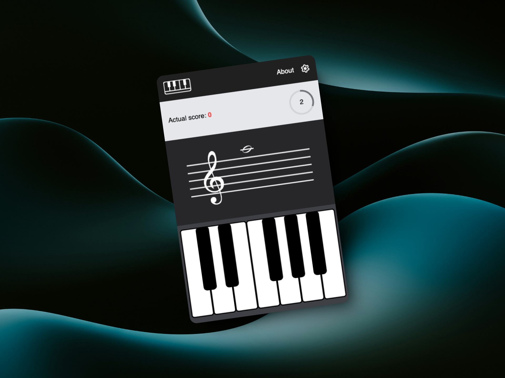

# Piano Note Study 🎹

A web application designed to help musicians and students practice reading sheet music notes. Challenge yourself to identify notes in both treble and bass clefs while racing against time!



## Features 🌟

-   **Multiple Clefs**: Practice with both treble (G) and bass (F) clefs
-   **Interactive Piano**: Responsive piano keyboard interface
-   **Score System**: Track your progress with a point-based system
-   **Timer Challenges**: Race against time to identify notes
-   **Visual Feedback**: Immediate feedback on correct/incorrect answers
-   **Clean UI**: Modern interface with smooth animations
-   **Settings**: Customize your learning experience

## Live Demo 🌐

Try the application here: [Piano Note Study](https://piano-note-study.vercel.app/)

## Technologies Used 🛠️

-   React 18
-   TypeScript
-   Vite
-   Tailwind CSS
-   Framer Motion
-   ESLint

## Getting Started 🚀

### Prerequisites

-   Node.js (v16 or higher)
-   npm or yarn

### Installation

1. Clone the repository

```bash
git clone https://github.com/yourusername/piano-note-study.git
```

2. Navigate to the project directory

```bash
cd piano-note-study
```

3. Install dependencies

```bash
npm install
```

4. Start the development server

```bash
npm run dev
```

5. Build for production

```bash
npm run build
```

## How to Play 🎮

1. **Select Your Clef**: Choose between treble and bass clef in the settings menu
2. **Identify Notes**: A random note will appear on the musical staff
3. **Play the Note**: Click the corresponding key on the piano keyboard
4. **Score Points**:
    - +5 points for correct answers
    - -3 points for incorrect answers
    - -2 points if time runs out
5. **Beat the Clock**: Try to identify notes before the timer runs out!

## Project Structure 📁

```
src/
├── components/
│   ├── menu/
│   ├── pianoKeys/
│   ├── pianoSheet/
│   └── stats/
├── helpers/
├── assets/
└── App.tsx
```

## Contributing 🤝

Contributions are welcome! Here's how you can help:

1. Fork the repository
2. Create your feature branch (`git checkout -b feature/AmazingFeature`)
3. Commit your changes (`git commit -m 'Add some AmazingFeature'`)
4. Push to the branch (`git push origin feature/AmazingFeature`)
5. Open a Pull Request

## Development 👨‍💻

To start development:

```bash
npm run dev
```

For linting:

```bash
npm run lint
```

## Building for Production 🏗️

To create a production build:

```bash
npm run build
```

To preview the production build:

```bash
npm run preview
```

## Author ✨

Lucas Diaz

-   Portfolio: [lucasdiaz.site](https://lucasdiaz.site/)
-   GitHub: [My GitHub Profile](https://github.com/LucasDDiazCuenca/)

## License 📝

This project is licensed under the MIT License - see the [LICENSE](LICENSE) file for details.

## Acknowledgments 🙏

-   Thanks to all contributors who have helped shape this project
-   Special thanks to the React and Vite communities for their excellent documentation
-   Icons and assets from [Google Icons](https://fonts.google.com/icons)

---

Made with ❤️ by Lucas Diaz
